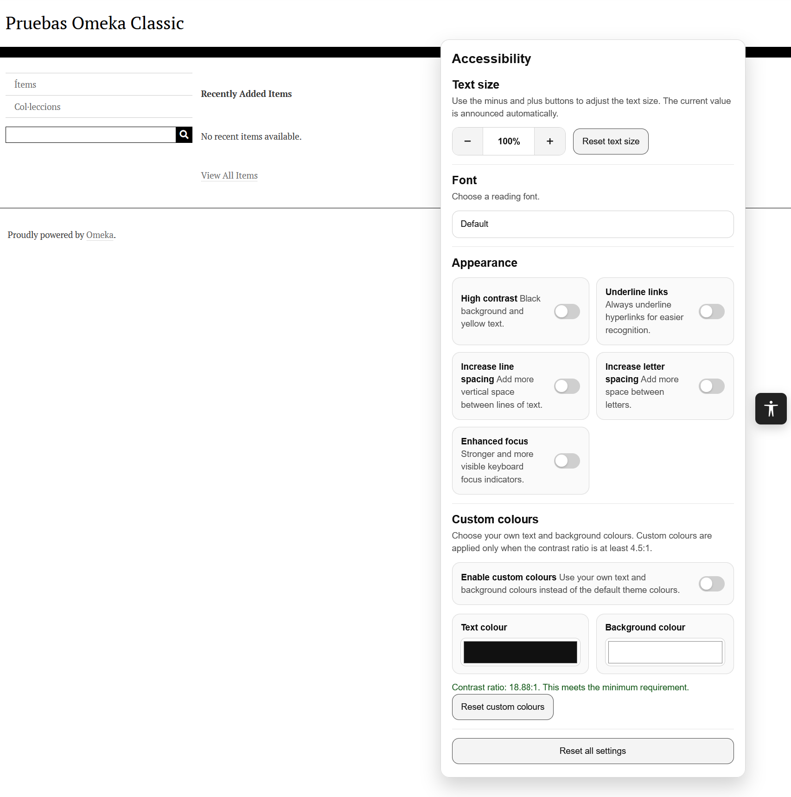

# Accessibility Toolbar

Accessibility Toolbar is a plugin for **Omeka Classic** that adds a floating accessibility button to the public site.  
When activated, it opens a panel with several interface customisation options designed to improve readability, visual comfort, and keyboard accessibility.

The plugin is intended to give visitors quick access to common accessibility adjustments without requiring modifications to the underlying theme files.

## Features

The toolbar currently includes the following options:

- Increase text size
- Decrease text size
- Reset text size
- Choose a more readable font:
  - Default
  - Arial
  - Verdana
  - Comic Sans
  - OpenDyslexic
- High contrast mode
- Underline links
- Increase line spacing
- Increase letter spacing
- Enhanced focus indicators
- Custom text and background colours
- Reset custom colours
- Reset all settings

The plugin is also prepared for gettext-based localisation.

## How it works

The plugin adds a floating button on the public side of the website.  
When selected, the button opens an accessibility panel that allows visitors to apply different appearance settings to the current interface.

User preferences are stored in the browser using `localStorage`, so settings persist across pages and future visits on the same browser.

The plugin is designed to keep the toolbar itself visually stable while applying changes to the rest of the page.

## Main accessibility options

### Text size controls

Visitors can increase or decrease the text size in steps, and reset it to the default value at any time.

### Font selection

The plugin allows visitors to switch to a more readable typeface.  
OpenDyslexic is included locally in the plugin.

### High contrast

This option applies a high contrast presentation mode intended to improve readability for some users.

### Link underlining

This option forces links to appear underlined, making them easier to identify.

### Line and letter spacing

Visitors can increase line spacing and letter spacing to improve reading comfort.

### Enhanced focus

This option strengthens visible focus indicators for keyboard users.

### Custom colours

Visitors can choose their own text and background colours.  
The plugin validates the contrast ratio before applying them. Custom colours are only enabled when the selected combination reaches at least **4.5:1** contrast ratio.

## Keyboard accessibility

The toolbar has been designed to support keyboard interaction:

- The floating button can be reached by keyboard
- The panel can be opened and closed without a mouse or keyboard
- Toggle cards can be activated with:
  - mouse
  - Space
  - Enter
- The panel can be dismissed with the `Escape` key
- Changes are announced through a live region where appropriate

## Scope

This plugin affects only the **public theme** of Omeka Classic.  
It does **not** modify the administrative interface.

## Notes on accessibility compliance

This plugin can help provide visitors with useful interface adjustments, but it does **not** guarantee WCAG conformance by itself.

Accessibility compliance depends on the full website, including:

- theme structure
- content
- colour choices
- keyboard behaviour
- forms
- media
- heading structure
- alternative text
- many other factors

The toolbar should therefore be understood as a supportive accessibility layer, not as a substitute for a proper accessibility review of the theme and content.

## Installation

Install in the usual Omeka Classic way:

1. Download the plugin
2. Unzip it
3. Rename the folder to `AccessibilityToolbar` if needed
4. Upload it to the `plugins` directory of your Omeka Classic installation
5. Go to the Omeka administration interface
6. Activate the plugin from the plugins page

## Localisation

The plugin is prepared for localisation using gettext.

All user-facing strings in the PHP code are written in English and wrapped for translation.  
Translation files are stored in the `languages` directory.

Typical files include:

- `template.pot` — translation template
- `ca_ES.po` — editable Catalan translation
- `ca_ES.mo` — compiled Catalan translation used by Omeka

To add or update a translation:

1. Use `template.pot` as the source template
2. Create or update the corresponding `.po` file for the target locale
3. Translate the `msgstr` entries
4. Compile the `.po` file into a `.mo` file
5. Save the files in the `languages` directory

The plugin includes a Catalan (`ca_ES`) translation as an example.

The plugin registers its translation source during initialisation so that Omeka can load the correct translation files when that locale is active.

## Included assets

The plugin includes local font files for **OpenDyslexic**.

## Persistence of settings

Settings are stored in the visitor's browser through `localStorage`.  
This means:

- settings persist between pages
- settings remain active on future visits in the same browser
- settings are browser-specific and device-specific

## Theme compatibility

The plugin is designed to work across different Omeka Classic themes.  
However, some themes use highly specific CSS rules that may interfere with the toolbar or with page-wide visual overrides.

To improve compatibility, the plugin includes additional style isolation for the widget itself and dynamic style injection for appearance-related modes.

Even so, theme-specific adjustments may occasionally be necessary.

## What the plugin does not do

The plugin does not:

- automatically repair inaccessible theme markup
- add missing alternative text
- correct heading structure
- fix inaccessible forms by itself
- guarantee full compliance with WCAG 2.2

## Recommended use

This plugin is especially useful when you want to offer visitors quick visual adjustments without editing the theme manually.

It is a good complement to:

- accessible theme development
- keyboard testing
- colour contrast review
- content accessibility review
- WCAG evaluation workflows

## License

GPLv3

## Author

Rubén Alcaraz Martínez
